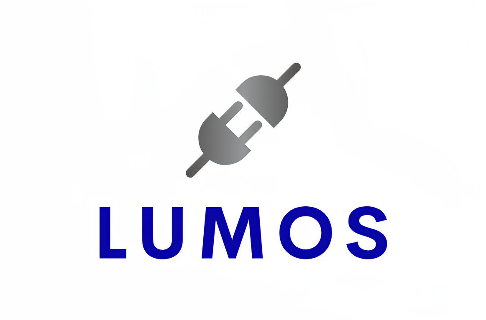

# SubstationAI

## Introduction

 Our project aims to create an intelligent Substation Maintenance Chatbot and website which has different features for the users to get their queries about power surges and different substation works answered. Currently this repository only has the basic implemention of chatbot and frontend.The chatbot is designed to assist users in querying maintenance procedures, acceptable limits, and other information related to substation equipment.

## Project Structure

Our repository contains two main folders:

1. **Flask App**: This folder contains the basic implementation of the chatbot. It includes a Flask web application that serves as the backend for the chatbot.

2. **Frontend**: The "Frontend" folder represents the user interface of the chatbot. It provides users with a basic chat interface to input questions or queries. Please note that this frontend is in its initial stage and does not have the capability to answer questions. It is designed to serve as a starting point for building the user interface of the chatbot.

## Project Status

Our project is currently in the early stages of development. We have implemented the basic of chatbot. However, please be aware that other advanced features, such as question answering and real-time maintenance information retrieval, are currently under development.

